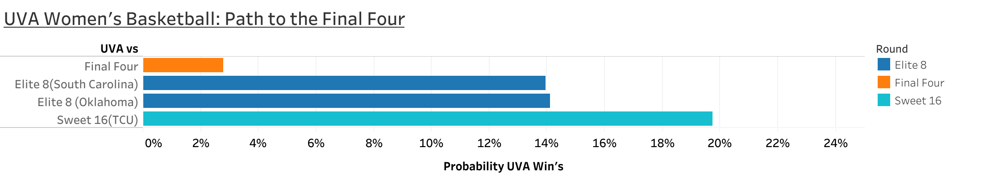

# 🏀 UVA Women’s Basketball: Path to the Final Four

This project builds a simple predictive model to estimate the probability of UVA Women’s Basketball reaching the Final Four.

## 📊 Model Approach

Using key performance metrics:

* Offensive rebound rate
* Defensive rebound rate
* Turnover rate
* Free throw percentage
* Field goal percentage

I created a weighted scoring system to estimate matchup win probabilities.

## 🔢 Method

* Calculated differences between UVA and opponent stats
* Applied weights to each feature
* Converted scores to probabilities using a logistic function
* Modeled sequential probabilities to estimate Final Four likelihood

## 📈 Results

* Sweet 16 vs TCU: ~19.7%
* Elite 8 vs South Carolina: ~13.9%
* Elite 8 vs Oklahoma: ~14.1%
* Final Four probability: ~2.8%

## 💡 Key Insight

While UVA has competitive metrics, the compounded difficulty of sequential matchups significantly reduces Final Four probability. I still will be cheering for them all the way, GO HOOS! 

## 🛠️ Tools Used

* Python (pandas, numpy)
* Tableau (visualization)

---

*Built as part of my MSDS journey at UVA*
